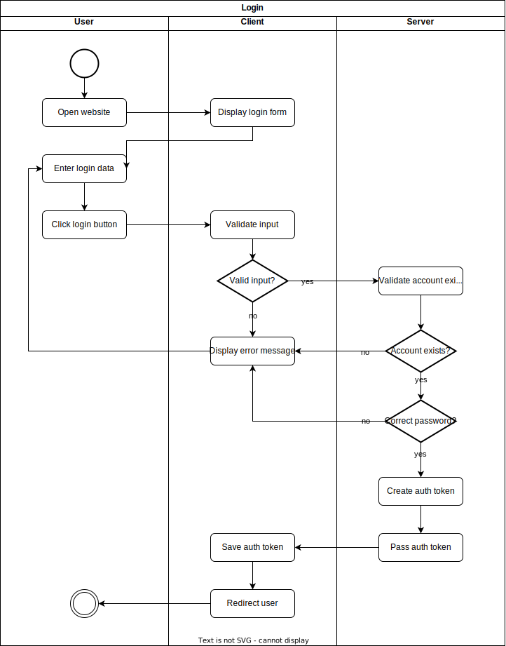
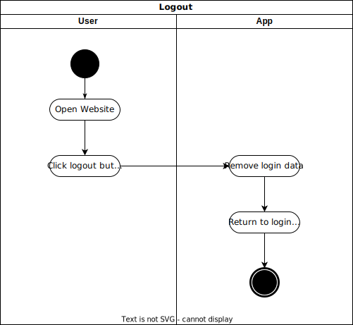
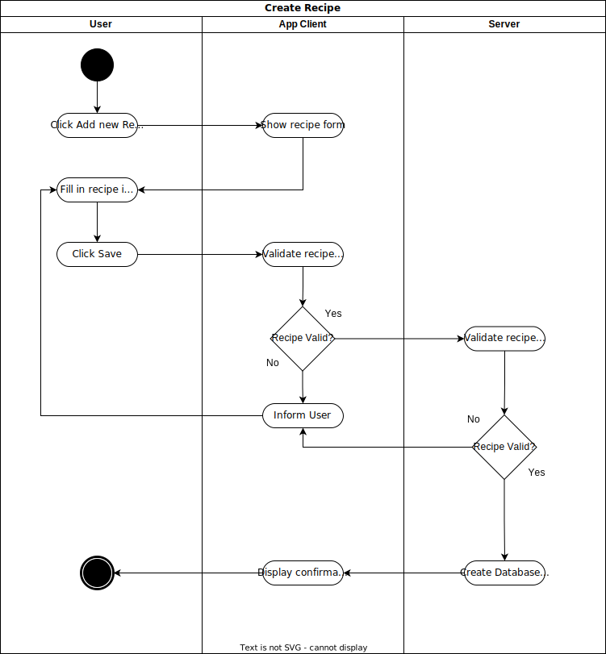

#  

# Software Requirements Specification
> This template is a simplified version based on the documentation templates from IBM Rational Unified Process (RUP).
## 1. Introduction
### 1.1 Overview
> CookHub is envisioned to be an online recipe book designed to store its own recipes in a database, offer recipe suggestions via the OpenAI API, save custom-created recipes, and generate a shopping list from an existing recipe. Additionally, the OpenAI API enables a recipe to be transformed into an adventure by wrapping the cooking instructions into an automatically generated adventure story, making cooking a real experience.
### 1.2 Scope
> This Software Requirements Specification (SRS) document covers the complete system of CookHub. It encompasses both functional and non-functional requirements necessary for the successful development, deployment, and operation of the platform. The document aims to provide a comprehensive understanding of the system's architecture, features, and limitations.

*Specifically, the SRS includes:*

> An overview of the system and its intended use.
Detailed specifications of functional requirements, such as recipe storage, recommendation algorithms, and shopping list generation.
Non-functional requirements, such as performance metrics, security considerations, and user experience factors.
A list of the technologies chosen for the system's development and the reasons behind their selection.

*The document does not cover:*

> Implementation details or code-level specifications.
Project management aspects, such as timelines or resource allocation, which will be handled in separate project planning documents.
This SRS aims to be a standalone document for stakeholders to understand what CookHub aims to achieve and how it intends to meet those goals.

### 1.3 Definitions, Acronyms and Abbreviations
> To ensure a common understanding among all stakeholders, this section provides definitions for key terms, acronyms, and abbreviations used throughout this SRS document.

- CookHub: The name of the online recipe book platform that this SRS outlines.
- SRS: Software Requirements Specification, the document you are currently reading, which outlines the requirements for CookHub.
- API: Application Programming Interface, a set of rules and protocols for building and interacting with software applications.
- OpenAI API: The API provided by OpenAI used for generating recipe suggestions and adventure stories within CookHub.
- React: A JavaScript library for building user interfaces.
- .Net: A free, cross-platform, open-source developer platform for building many different types of applications.
- C#: A modern object-oriented programming language that is designed for building Windows desktop applications and games.
- JS/TS: JavaScript/TypeScript, scripting languages used to enable interactive web pages.
- TMETRIC: A time tracking tool used for project management within the development process.
- GitHub: A web-based platform used for version control and source code management.
- Functional Requirements: The features that CookHub must implement to fulfill its intended purpose.
- Non-Functional Requirements: The performance, security, and usability specifications that CookHub must adhere to.

> *This glossary is intended to serve as a reference point for understanding the specialized language used in this document.*

### 1.4 References

> The following is a list of documents, sources, and tools referenced in the creation of this Software Requirements Specification:

- **React Official Documentation**: [React - A JavaScript library for building user interfaces](https://reactjs.org/), Accessed October 2023, Facebook Inc.
- **.NET Documentation**: [.NET Documentation](https://docs.microsoft.com/en-us/dotnet/), Accessed October 2023, Microsoft Corporation
- **C# Programming Guide**: [C# Guide](https://docs.microsoft.com/en-us/dotnet/csharp/), Accessed October 2023, Microsoft Corporation
- **JavaScript and TypeScript Documentation**: [MDN Web Docs](https://developer.mozilla.org/en-US/docs/Web/JavaScript), Accessed October 2023, Mozilla
- **TMETRIC Official Website**: [TMETRIC - Time Tracking Tool](https://tmetric.com/), Accessed October 2023, Devart
- **GitHub Documentation**: [GitHub Docs](https://docs.github.com/en), Accessed October 2023, GitHub Inc.
- **OpenAI API Documentation**: [OpenAI API Docs](https://beta.openai.com/docs/), Accessed October 2023, OpenAI

> These references are intended to provide additional context and understanding for the technologies and terminologies used in this document.

## 2. Functional requirements
[!INFO] *This section contains all the software requirements to a level of detail sufficient to enable designers to design a system to satisfy those requirements and testers to test that the system satisfies those requirements. This section is typically organized by feature, but alternative organization methods may also be appropriate, for example, organization by user or organization by subsystem.*

> ✅ UML diagram:
>
> 

> To check the userstorys please check the issues tagged with userstorys -> https://github.com/SE-TINF22B6/CookHub/issues

### 2.1 Overview 
> A brief description of the functionality of your application.  
> Include one or more **UML use case** diagram(s) and necessary description to specify the major use cases of your application.

### 2.2 User Interface & Account Management

> - **user stories**: https://github.com/SE-TINF22B6/CookHub/issues/10, https://github.com/SE-TINF22B6/CookHub/issues/11, https://github.com/SE-TINF22B6/CookHub/issues/13 
> - UML diagram: https://github.com/SE-TINF22B6/CookHub/blob/main/use-case-diagram.drawio.svg
> - **Preconditions**: Backend servers has to be active.
> - **Postconditions**: All outgoing routes of functions has to work correctly.
> - **Estimated efforts**: middle

 ✅ (1) Landing page mockup,  (2) After implementation  with HTML & CSS
 <table>
  <tr>
    <td></td>
    <td></td>
  </tr>
 </table>

 ✅ (1) Login page mockup, (2) After implementation with HTML & CSS
 <table>
  <tr>
    <td></td>
    <td></td>
  </tr>
 </table>

✅ (1) Profile page mockup
 <table>
  <tr>
    <td><td>
  </tr>
 </table>

✅ (1) Settings page mockup
 <table>
  <tr>
    <td></td>
  </tr>
 </table>

> ✅ Login activity diagram:
>
> 

> ✅ Logout activity diagram:
>
> 

> ✅ Login sequence diagram:
>
> 

### 2.3 Recipes Management

> - **user stories**: https://github.com/SE-TINF22B6/CookHub/issues/16, https://github.com/SE-TINF22B6/CookHub/issues/35, https://github.com/SE-TINF22B6/CookHub/issues/38, https://github.com/SE-TINF22B6/CookHub/issues/34
> - UML diagram: https://github.com/SE-TINF22B6/CookHub/blob/main/use-case-diagram.drawio.svg
> - **Preconditions**: Backend servers has to be active, LogIn/LangingPages must be active.
> - **Postconditions**: All outgoing routes of functions has to work correctly.
> - **Estimated efforts**: middle

> ✅ Activity diagram for creating and saving a recipe:
>
> 

> ✅ Sequence diagram for generating a recipe text with OpenAI:
>
> 

### 2.4 Special Features
>
>This section contains all the functions apart from the familiar standard features that ordinary cooking apps offer. 
>
> #### Adventurize it Ⓒ
>
>Adventurize it Ⓒ is our copyrighted shooting star and set to be our unique selling point for the app.
>It takes recipes, lists of ingrediences or even just descriptions of dishes and converts it into short adventure stories lifting cooking into a new sphere of enjoyable experience.
>Turn your next dinner into a hero saga or let your toddlers enjoy their first cooking experience by defeating the grumpy Bolognese-Dragon!
>
>#### Placement
>
>The feature is planed to be available unmonitorized in a basic-story mode but will require an free account on CookHub.
>Our future plan contains providing more options to stir the story into a prefered direction as well as preset characters and other elements.
>As soon as our community and our recipe database has reached a certain size to kick off a monitarization model we will start to offer
>more additional features to make CookHub the place to go if you want to prepare another meal.
>
>#### Technology
>
>In the background, we will integrate the OpenAI API into our project, which will be pre-trained and pre-tested by our team to meet the special requirements.
>The API can accept a standard prompt that has been preset and perfected by our team or the user can submit their own requests in a form, which are then injected into a modified wrapping prompt.
>After generation, the API then returns the response to our backend, which makes it available to the user and creates a copy in our database, which is then available as a recipe variant of the original dish.
>Unspecific user requests can be covered at no additional cost by using the API to provide already generated recipes.
>
>#### Training & Testing
>
>There have been many testings with differnet prompts, command sizes and directions. To have a look on one of our first prototypes you can check our [wiki page](https://github.com/SE-TINF22B6/CookHub/wiki/adventurize-it-%E2%92%B8).
>But after OpenAIs release of specialized, own preseted GPT-models we worked on an upgraded version of our recipe-converted.
>
>Here is a short [Overview](https://github.com/SE-TINF22B6/CookHub/wiki/adventurize-it-%E2%92%B8-%5B-v0.7-%5D) of the new Setup and below the generated recipe:
>
>
>
>Legal notice: We may still have to have the legal provisions regarding copyright checked by our legal department.

### 2.5 Data Administration

> - **user stories**: https://github.com/SE-TINF22B6/CookHub/issues/37, https://github.com/SE-TINF22B6/CookHub/issues/40
> - UML diagram: https://github.com/SE-TINF22B6/CookHub/blob/main/use-case-diagram.drawio.svg
> - **Preconditions**: Backend servers has to be active, DB must be connected.
> - **Postconditions**: All outgoing routes of functions has to work correctly.
> - **Estimated efforts**: high

## 3. Nonfunctional requirements

> Categories: Usability, Reliability, Performance, Efficiency, Integrity, Maintainability, Flexibility, Testability, Reusability, Security.  

## 4. Technical constraints

> This section identifies the constraints that affect the technical aspects of the CookHub platform. These constraints limit the design and implementation options available and thus must be considered when making technical decisions.

### 4.1 Technology Stack
> React: Given that React is part of the chosen technology stack, the frontend must be built using this library.
> .Net & C#: The backend will be implemented using the .Net framework and C# programming language, restricting the use of technologies that are not compatible with these.
> JS/TS: Only JavaScript and TypeScript are to be used for scripting.
> TMETRIC: All time tracking must be logged through TMETRIC, limiting the use of other time-tracking software.
> GitHub: Source code management and version control must be done exclusively through GitHub.

### 4.2 Third-Party APIs
> OpenAI API: Given that the OpenAI API is used for generating recipe suggestions and adventure stories, CookHub is subject to the limitations, costs, and terms of service of the OpenAI API.
>
> /// Start of testing ChatGPT (WebApp) to convert recipes ///
>
> 

### 4.3 Performance
> Response Time: The system should respond to user queries within 2 seconds to maintain a smooth user experience.
> Scalability: The system must be able to support up to 100 concurrent users in the beginning.

### 4.4 Security
> Data Encryption: All sensitive user data must be encrypted.
> Authentication: Secure authentication mechanisms (username + pw) must be implemented to protect user accounts.

# ##4.5 Compliance
> GDPR: The platform must comply with GDPR regulations, affecting how user data can be stored and processed.

*This section aims to outline the technical constraints that will affect the development and operation of CookHub. Acknowledging these constraints is crucial for the successful implementation of the system.*
